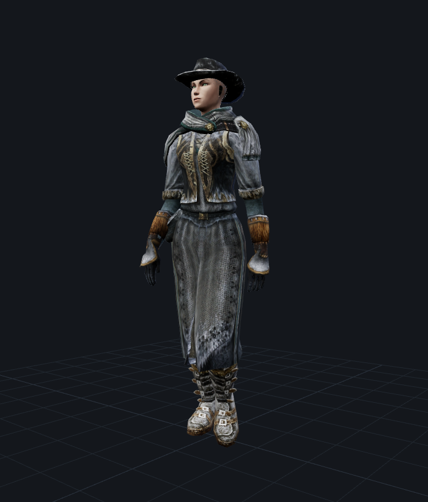
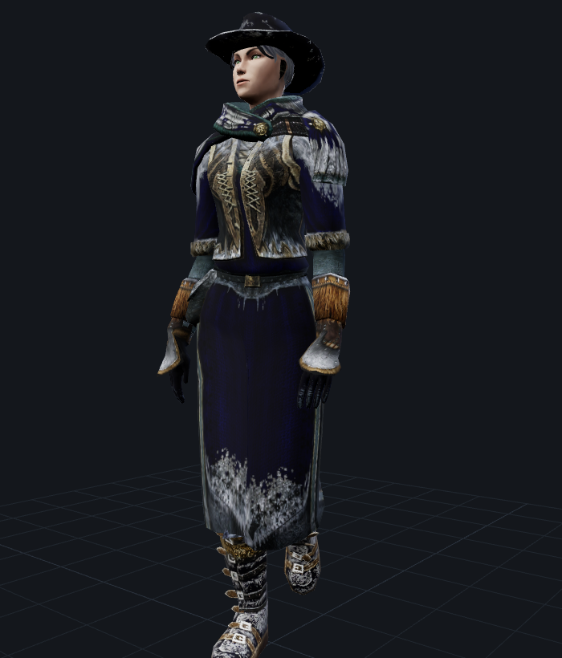
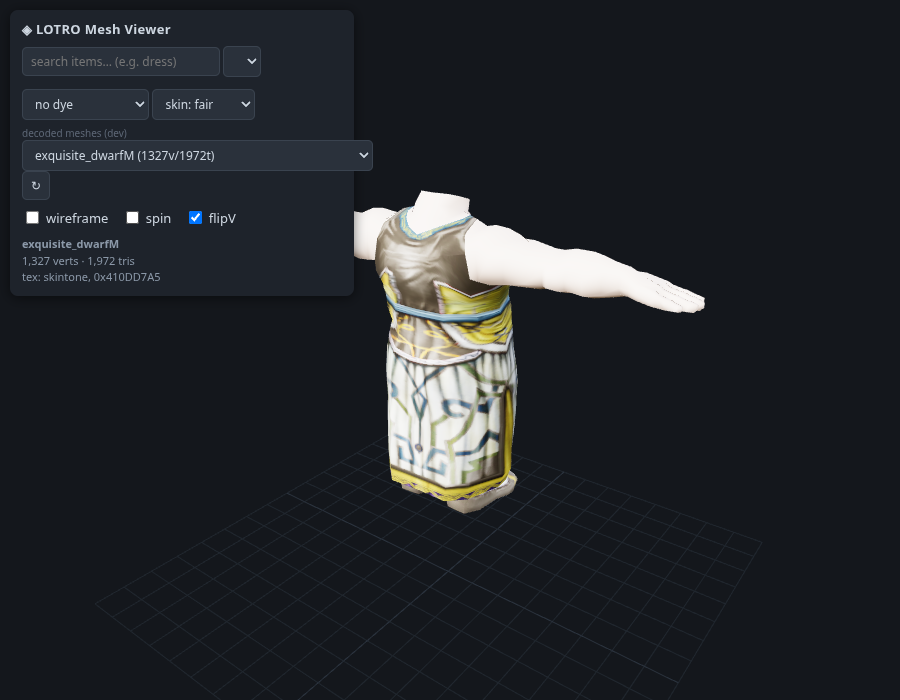
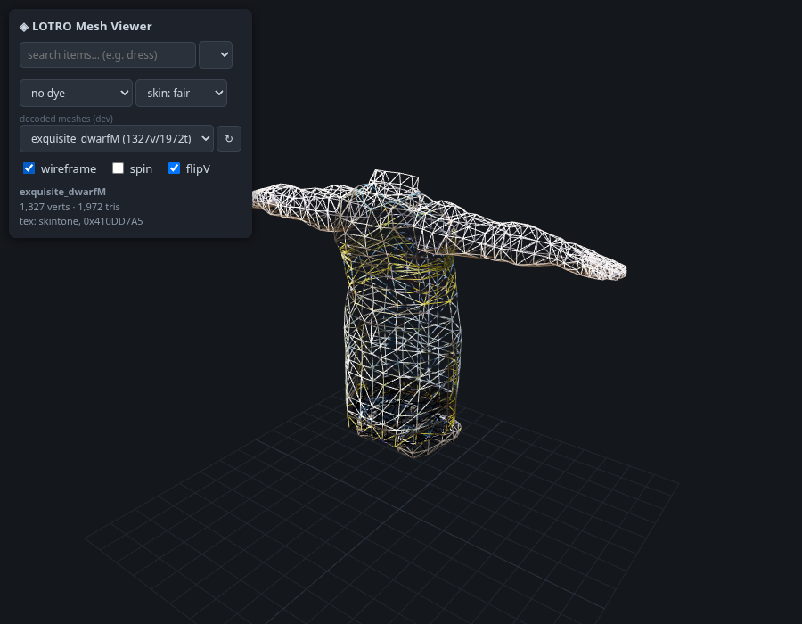

# lotro_mesh_viewer — LOTRO client asset extraction & viewer

Reverse-engineered tooling to extract and render 3D meshes, textures, item
data, dyes and skeletal animation from the **Lord of the Rings Online** client
`.dat` archives — plus a local three.js viewer to browse the results.

The long-standing community belief that LOTRO meshes are an
un-extractable/encrypted format is **false**: `client_mesh.dat` is a standard
Turbine DAT archive holding zlib-compressed Turbine **GfxObj**-family geometry
(the same engine lineage as Asheron's Call and DDO), and this repository
decodes it. As far as we know this is the first published LOTRO mesh decoder:
the deepest previously published effort,
[jtauber/lotro](https://github.com/jtauber/lotro), solved the container and
texture formats but has no mesh parser.


*Every researched feature in one screenshot: a character's saved outfit
loaded from [LotroCompanion](https://github.com/LotroCompanion) data (the
"toon" dropdown), each slot resolved to its per-body garment mesh, textures
and per-slot dyes applied (Red/Crimson here), hair and an alpha-cutout
headpiece rendered by shader classification, and the whole avatar skinned to
a skeleton with animation playback. See
[the outfit-composer walkthrough](docs/outfit-composer.md) for how each
control maps to the modules in this repo.*

|  |  |
|:--:|:--:|
| The *Snow-dusted Travelling* set — five items resolved, composed and skinned onto an Elf body, mid walk cycle | The same outfit with the *Ered Luin Blue* dye applied: dyeable cloth tints, snow/fur/metal regions don't |

Everything in these renders — geometry, textures, skinning, the walk
animation, the dye math — was decoded from the `.dat` files by the code in
this repository.

## What works

| Area | Status |
|---|---|
| DAT container (header, B-tree directory, block chains, zlib) | Proven |
| GfxObj mesh decode, static + skinned (one unified format) | Proven, visually validated |
| DXT texture decode + material → diffuse resolution | Proven |
| `0x2B` shader classification (alpha cutout vs. tint mask, dyeable, metallic) | Proven, not yet consumed by the viewer — see [shaders](docs/shaders.md) |
| Item PropertiesSet parse (typed, via the client's property dictionary) | Proven |
| Item → per-race/sex body → garment mesh + material selector | Proven |
| Dye system (floatCode model, palette, render math) | Proven |
| Skeleton + skin weights + Havok spline-compressed clips | Mostly working |
| Per-item garment geometry on *every* body (human data holes) | Open — see [limitations](docs/limitations.md) |

See [docs/overview.md](docs/overview.md) for the end-to-end pipeline and
[docs/limitations.md](docs/limitations.md) for what is not solved yet.

## Quickstart: this is how you get it running

From zero to a textured garment in your browser in about 3 minutes (plus
~5 minutes of one-time catalog extraction if you want item search by name).
You need **Python 3.8+** and a **LOTRO installation** — the tools only read
the game's `client_*.dat` files, they never modify them.

```bash
# 1. Clone and install dependencies                                (~1 min)
git clone https://github.com/Mirarkitty/lotro_mesh_viewer.git
cd lotro_mesh_viewer
pip install numpy Pillow flask

# 2. Point the tools at your game install (adjust the path;
#    every tool also accepts --game-dir instead)
export LOTRO_DIR="$HOME/The Lord of the Rings Online"

# 3. Smoke test: decode one mesh                                   (seconds)
python3 mesh_decode.py 0x06001989
#    -> prints stats; "sliver_tris 0" and "indices_in_range True" = working

# 4. Compose a real garment (Exquisite Dress on the Dwarf body)
#    and start the viewer                                          (~30 s)
python3 compose.py 0x7000DA5B 0x20001E58 exquisite_dwarfM
python3 app.py
#    -> open http://127.0.0.1:8722/ and pick "exquisite_dwarfM":
#       you should see the shaded dress from the screenshot below

# 5. Build the item catalog once — it powers item/set search by name
#    and the outfit composer                                       (~5-10 min)
python3 items_catalog.py

# 6. The payoff: the full outfit composer                          (~1 min)
#    Point it at your LotroCompanion character data — the ".lotrocompanion"
#    directory LotroCompanion maintains in your home directory. This default
#    is found automatically when the composer runs as the same user; setting
#    it explicitly is only needed for another account or a copied directory:
export LOTRO_COMPANION_DIR="$HOME/.lotrocompanion/data/characters"

python3 outfit_app.py
#    -> open http://127.0.0.1:8723/ — search items or whole armour sets
#       per slot, pick body/dyes, watch the skinned avatar animate.
#
#    THIS IS HOW YOU LOAD AN OUTFIT FROM LOTROCOMPANION: with the data
#    directory found, a "toon" row appears — pick your character, then one
#    of its saved outfits: every slot fills with the right item and dye,
#    exactly as saved in-game.
#    (No LotroCompanion? https://github.com/LotroCompanion/lotro-companion —
#    the composer works fine without it, just with no saved-outfit loader.)
```

(`pip install -r requirements.txt` works too; Flask is optional — without
it `app.py` falls back to a stdlib server with the basic routes. Playwright
is only needed for `screenshot.py`, see
[its docs](docs/scripts/screenshot.md).)

That's the whole setup. More one-liners to try:

```bash
python3 tex_extract.py texture 0x41231998   # extract one texture to PNG
python3 selector.py 0x70021A13              # item -> per-body mesh/material/texture bindings
python3 shaders.py                          # the classified 0x2B shader table
python3 havok_anim.py 0x050039EA            # decode an animation clip
```

Item DIDs are hex numbers, not names — to find a DID from an item's *name*,
build the catalog (step 5) and use the viewer's search box or `grep` the
JSONL directly, or use
[LotroCompanion](https://github.com/LotroCompanion)'s public item databases
(e.g. [lotro-data](https://github.com/LotroCompanion/lotro-data) /
`lotro-items-db`), which index items by name against the same DIDs.

The viewer serves a mesh browser with item search, per-body composition and
dye preview at `/`, and skinned-animation playback at `/anim`.

|  |  |
|:--:|:--:|
| The viewer showing a composed garment (Exquisite Dress on the Dwarf body) | The wireframe toggle — part of the visual-verification loop |

Item search (`/search`) requires `items_catalog.jsonl` to exist — build it
with `items_catalog.py` above before using the search box.

For **named item lookup or character/inventory context** (not raw DID
extraction), see the [LotroCompanion](https://github.com/LotroCompanion)
project — `lotro-data`/`lotro-items-db` for item name databases,
`lotro-companion` for character data. This toolkit's own alternative is
[`items_catalog.py`](items_catalog.py): it builds a local, searchable
`items_catalog.jsonl` straight from the client files (no external data
needed), which is what the viewer's item search box queries.

## Documentation

**Formats** (byte-level, enough to re-implement without this code):
[overview](docs/overview.md) ·
[DAT container](docs/dat-format.md) ·
[mesh/GfxObj](docs/mesh-format.md) ·
[textures & materials](docs/textures.md) ·
[shaders](docs/shaders.md) ·
[PropertiesSets](docs/properties.md) ·
[wardrobe/worn appearances](docs/wardrobe.md) ·
[dyes](docs/dyes.md) ·
[hair & face](docs/hair-face.md) ·
[animation](docs/animation.md) ·
[limitations](docs/limitations.md)

**Scripts** (usage, API, internals): see
[docs/scripts/INDEX.md](docs/scripts/INDEX.md).

| Script | Role |
|---|---|
| [`config.py`](config.py) | shared game-dir/output configuration ([docs](docs/scripts/config.md)) |
| [`datfile.py`](datfile.py) | Turbine DAT container reader ([docs](docs/scripts/datfile.md)) |
| [`mesh_decode.py`](mesh_decode.py) | GfxObj mesh decoder, static + skinned ([docs](docs/scripts/mesh_decode.md)) |
| [`tex_extract.py`](tex_extract.py) | DXT textures + material→diffuse resolution ([docs](docs/scripts/tex_extract.md)) |
| [`shaders.py`](shaders.py) | `0x2B` shader classification: alpha-test cutout vs. tint mask, dyeable, metallic ([docs](docs/scripts/shaders.md)) |
| [`propset.py`](propset.py) | PropertiesSet deserializer ([docs](docs/scripts/propset.md)) |
| [`selector.py`](selector.py) | item → garment mesh/material selector ([docs](docs/scripts/selector.md)) |
| [`wearable2.py`](wearable2.py) | strict 0x20 worn-appearance parser ([docs](docs/scripts/wearable2.md)) |
| [`compose.py`](compose.py) | item × body → single textured viewer mesh ([docs](docs/scripts/compose.md)) |
| [`items_catalog.py`](items_catalog.py) | searchable wearable-item catalog ([docs](docs/scripts/items_catalog.md)) |
| [`havok_anim.py`](havok_anim.py) | Havok tagfile + spline-clip decoder ([docs](docs/scripts/havok_anim.md)) |
| [`export_skinned.py`](export_skinned.py) | mesh + skeleton + clip export ([docs](docs/scripts/export_skinned.md)) |
| [`app.py`](app.py) + [`index.html`](index.html) / [`anim.html`](anim.html) | local three.js viewer ([docs](docs/scripts/viewer.md)) |
| [`outfit_app.py`](outfit_app.py) + [`outfit.html`](outfit.html) | full outfit composer incl. the LotroCompanion outfit loader ([docs](docs/outfit-composer.md)) |
| [`api_common.py`](api_common.py) | composer backend: search, sets, clips, LotroCompanion import ([docs](docs/scripts/api_common.md)) |
| [`charparts.py`](charparts.py) | chargen head/hair/beard parts ([docs](docs/scripts/charparts.md)) |
| [`screenshot.py`](screenshot.py) | headless visual verification ([docs](docs/scripts/screenshot.md)) |

## Verification culture

The single most important lesson of this project: **numeric checks on decoded
geometry repeatedly looked correct while being wrong** — only rendered
screenshots caught the bugs. Decode → render → *look at the image* → validate
on at least two independent examples. `screenshot.py` automates the loop;
`mesh_decode.stats()` provides the numeric sliver/index checks that complement
(never replace) the visual pass.

## Credits & prior art

- [ACEmulator/ACE](https://github.com/ACEmulator/ACE) — Asheron's Call
  emulator; its GfxObj/Setup parsers were the structural crib for the mesh
  format (LOTRO's on-disk layout diverged in the details).
- [jtauber/lotro](https://github.com/jtauber/lotro) — DAT container and
  texture/terrain parsing groundwork.
- [LotroCompanion](https://github.com/LotroCompanion) /
  dmorcellet's lotro-dat-utils — the PropertiesSet wire format and the
  `itemDID + 0x09000000` property-record convention.
- [PredatorCZ/HavokLib](https://github.com/PredatorCZ/HavokLib) — the
  spline-compressed animation decompression algorithm (ported to Python).
- [exyorha/hkxparse](https://github.com/exyorha/hkxparse) — Havok binary
  tagfile wire-format reference.

## Licensing

The repository as a whole is distributed under the **GPLv3** ([LICENSE](LICENSE)),
because [`havok_anim.py`](havok_anim.py) ports the spline-compressed-animation
decompressor from [PredatorCZ/HavokLib](https://github.com/PredatorCZ/HavokLib)
(GPLv3).

Every file **except** `havok_anim.py` is additionally available under the
**MIT license** ([LICENSE.MIT](LICENSE.MIT)). Practically: if you don't need
animation decoding, remove `havok_anim.py` (and `export_skinned.py`'s import
of it) and you may use everything else under MIT.

## Legal

This is an interoperability/preservation research project. It contains **no
extracted game assets** — only code, format documentation, and a few small
documentation screenshots of content rendered by the toolkit, included for
illustration. Extracting assets requires
your own legal installation of LOTRO; extracted content remains the property
of its copyright holders and must not be redistributed. LOTRO is a trademark
of Standing Stone Games / Middle-earth Enterprises; this project is not
affiliated with or endorsed by them.
