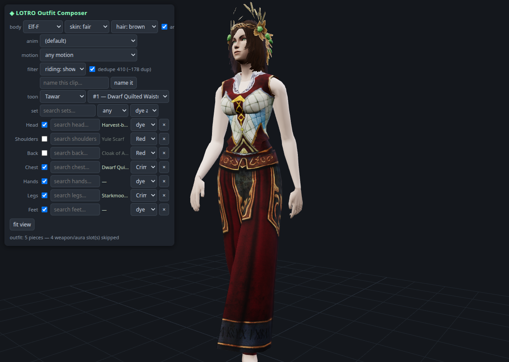

# The outfit composer & the saved-outfit loader

The outfit composer is the full-avatar front-end built on the modules in
this repository — one page that exercises every solved subsystem at once:
item resolution, wardrobe binding, mesh decode, textures, shader-driven
rendering, dyes, hair/face, skeleton and animation.

It is included in this repository: run it with

```bash
python3 items_catalog.py     # once: the catalog powers all search
python3 outfit_app.py        # -> http://127.0.0.1:8723/
```

(`outfit_app.py` + `outfit.html`, backend in
[api_common.py](scripts/api_common.md) and
[charparts.py](scripts/charparts.md); the repo's simpler
[viewer](scripts/viewer.md) (`app.py`) covers the single-item subset.)



*A saved character outfit ("toon" Tawar, outfit `#1 — Dwarf Quilted
Waistcoat…`) loaded and rendered: five slots resolved, per-slot dyes
applied, hair + alpha-cutout headpiece, skinned to the Elf-F skeleton.*

## The saved-outfit loader

The loader imports outfits saved by
[LotroCompanion](https://github.com/LotroCompanion/lotro-companion) — the
character-management app many players already run. LotroCompanion stores
each character ("toon") under its data directory
(`~/.lotrocompanion/data/characters/toon-*/`), including every saved
wardrobe outfit as a list of per-slot item IDs plus each slot's chosen dye
color.

Using it:

1. **Pick the toon** in the `toon` dropdown (populated from the
   LotroCompanion data directory; the row is hidden when no companion data
   is found).
2. **Pick a saved outfit** in the dropdown next to it — outfits are listed
   as `#N — <chest item name> (piece count)`.
3. Each of the outfit's slot items is then resolved exactly like a manual
   pick: item DID → [PropertiesSet](properties.md) →
   [worn-appearance record](wardrobe.md) for the chosen body →
   [mesh decode](mesh-format.md) → [material/diffuse](textures.md) →
   [shader render hints](shaders.md), with the saved **per-slot dye colors**
   applied via the [alpha-mask dye model](dyes.md).
4. Slots the renderer has no geometry pipeline for (weapons, auras, class
   items) are skipped and reported in the status line — e.g.
   `outfit: 5 pieces — 4 weapon/aura slot(s) skipped` in the screenshot.

Only the item IDs and dye names come from LotroCompanion; every byte of
geometry, texture and animation is decoded live from the client `.dat`
files by this repository's modules.

## What each control exercises

| Control | Module / format doc |
|---|---|
| `body` (race/sex) + `skin`/`hair` pickers | per-body [worn-appearance records](wardrobe.md), [hair & face](hair-face.md) |
| per-slot `search …` boxes | the catalog built by [items_catalog.py](scripts/items_catalog.md) |
| `set` search (whole armour sets) | catalog name-stem grouping over the same data |
| per-slot / set-wide `dye` dropdowns | the [dye system](dyes.md) (`alpha < 128` tint mask) |
| the `toon` / outfit dropdowns | the saved-outfit loader above |
| `anim`, `motion`, riding filters | [skeleton + clips](animation.md) via [havok_anim.py](scripts/havok_anim.md) / [export_skinned.py](scripts/export_skinned.md) |
| slot checkboxes (show/hide) | the slot-blanking mechanism in [wardrobe.md](wardrobe.md) |
| cutout/metal rendering | [shader classification](shaders.md) exported by [compose.py](scripts/compose.md) |

## See also

- [overview.md](overview.md) — the pipeline all of this sits on
- [scripts/viewer.md](scripts/viewer.md) — the released single-item viewer
- [limitations.md](limitations.md) — what still fails (human-body data
  holes, unfinished face compositor)
