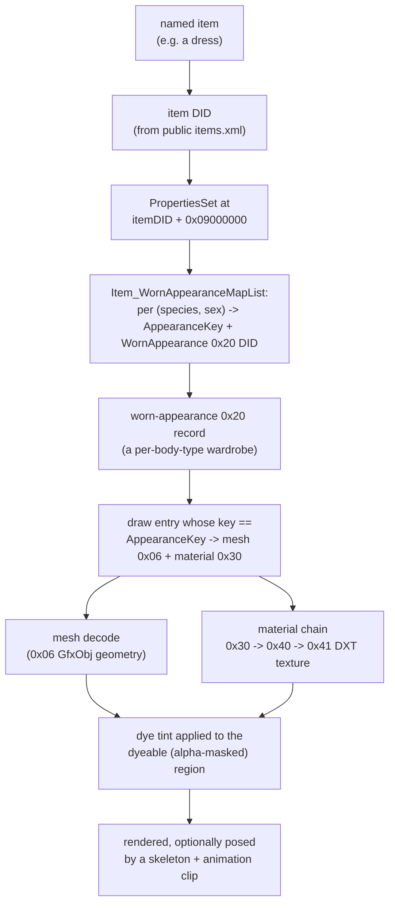

# Overview

This project reverse-engineers the data files shipped with the *Lord of the
Rings Online* (LOTRO) game client — the `client_*.dat` archives found in the
game's install directory — well enough to extract 3D meshes, textures, item
appearance data, dyes, and character animation without touching the running
game process. The goal that drove the investigation was an **outfit
composer**: given a named item (or a full "look"), render it on a chosen
race/sex body, in a chosen dye, posed and animated, entirely from static
client files.

That end goal breaks into four RE problems that have to be solved together:
the 3D mesh format, the texture format, the dye system, and — the hard one —
the property chain that maps an item ID to the *specific* per-race/sex
geometry and material it wears.

## Origin: "is it even possible?"

This project started as a feasibility check, not a build. The prevailing
belief (reinforced by the LOTRO Companion project's
["Champollion" proof-of-concept](https://github.com/LotroCompanion/lotro-companion/issues/124),
which announced a working mesh extractor around 2021–22 but never published
code or disclosed the format) was that the mesh archive's contents are an
opaque or encrypted blob. The deepest *published* prior RE effort,
[jtauber/lotro](https://github.com/jtauber/lotro), backs this up indirectly:
it fully solved the DAT container and the texture/terrain formats, but has no
mesh parser at all.

**That belief is false.** The mesh archive is a standard Turbine DAT archive
holding plain **zlib-compressed Turbine GfxObj-family geometry** — the same
engine lineage used by *Asheron's Call* and *Dungeons & Dragons Online*. The
Asheron's Call emulator projects
([ACEmulator/ACE](https://github.com/ACEmulator/ACE),
[aclogview](https://github.com/LtWigglesworth/aclogview)) fully parse the
AC-generation GfxObj/Setup formats, and served as the structural crib for
this work — even though LOTRO's on-disk layout diverged from AC's in the
details (see [mesh format](mesh-format.md)).

## End-to-end pipeline

Every arrow above has a corresponding decoder script (see
[scripts](scripts/) for per-tool documentation):

| Stage | Script |
|---|---|
| DAT container / archive access | [`datfile.py`](scripts/datfile.md) |
| Item PropertiesSet decode | [`propset.py`](scripts/propset.md) |
| Item → body → wardrobe entry selection | [`selector.py`](scripts/selector.md) |
| Mesh geometry decode | [`mesh_decode.py`](scripts/mesh_decode.md) |
| Texture extraction / material chain | [`tex_extract.py`](scripts/tex_extract.md) |

The **container, compression, mesh geometry, texture format, item→body→
appearance property chain, and wardrobe selector are all solved.** Rigging
(skeletons, animation clips, skin weights) also now works end-to-end for a
posed, animated render. What remains open is mostly about *coverage* and
*polish* rather than fundamental format questions — see
[limitations](limitations.md) for the honest list.

## Status summary

| Area | Status | Detail |
|---|---|---|
| DAT container (header, B-tree dir, block-chain, zlib) | **Proven** | [dat-format.md](dat-format.md) |
| GfxObj mesh decode (static + skinned, unified) | **Proven**, visually validated on many meshes | [mesh-format.md](mesh-format.md) |
| DID type map across archives | **Proven** for the types this project touches | [dat-format.md](dat-format.md) |
| DXT texture decode | **Proven** | [textures.md](textures.md) |
| Material → diffuse resolution | **Proven**, with documented traps | [textures.md](textures.md) |
| Item PropertiesSet parse (exact, typed) | **Proven** | [properties.md](properties.md) |
| Item → body → AppearanceKey → wardrobe entry (selector) | **Proven**, format fully derived and validated on 4,181/4,192 records | [wardrobe.md](wardrobe.md) |
| Wardrobe entry → material/diffuse | **Proven** | [wardrobe.md](wardrobe.md) |
| Wardrobe entry → own garment mesh | **Proven** for shipped bodies; some body types are genuine data holes in this install | [wardrobe.md](wardrobe.md) |
| Dye system (floatCode model, alpha-mask render math) | **Proven**, palette partially extracted | [dyes.md](dyes.md) |
| Head / hair / beard chargen selection | **Proven** | [hair-face.md](hair-face.md) |
| Rigging (skeleton + skin weights → posed, animated body) | **Mostly working**; specific gaps remain | [animation.md](animation.md) |

For the full open-problem list and the project's failure-mode log (several
"solved" claims that turned out to be wrong and how that was caught), see
[limitations.md](limitations.md).

## A note on verification discipline

This project's history includes more than one case where a decoder passed
every automated sanity check (vertex/triangle counts in range, no degenerate
triangles, indices in bounds) while still producing visibly wrong geometry —
and more than one case where a selector "worked" on the first test item by
coincidence and failed on the second. The rule that emerged, and that these
docs try to reflect throughout: **numeric validation is necessary but not
sufficient.** Claims in these docs are marked Proven only where they were
checked by rendering the result and looking at it, on at least two
independent examples. See [limitations.md](limitations.md) for the specific
incidents.

## See also
- [dat-format.md](dat-format.md) — the container format
- [mesh-format.md](mesh-format.md) — GfxObj geometry decode
- [textures.md](textures.md) — DXT textures and the material chain
- [properties.md](properties.md) — the PropertiesSet format and property dictionary
- [wardrobe.md](wardrobe.md) — worn-appearance records and the item selector
- [dyes.md](dyes.md) — the dye system
- [hair-face.md](hair-face.md) — head/hair/beard chargen selection
- [animation.md](animation.md) — skeletons, animation clips, skin weights
- [limitations.md](limitations.md) — open problems and the failure-mode log
- [INDEX.md](INDEX.md) — table of contents for this documentation set
